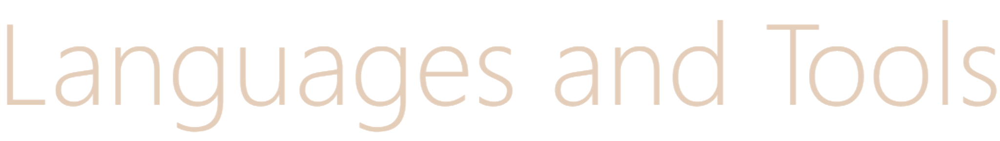

<!--Banner-->

<!--Header Name-->

<!--Start Intro-->               
* 📖 I'm a senior at UCLA studying math/computer science
* 🌱 I’m currently learning game development in Unity
* ⚡ Fun fact: I love lattes and cozy video games!
 
<!--End Intro-->

<!-- Divider -->

  

<!-- Languages and Tools Section -->

  

                        

 

<!-- Divider -->

  

<!--Contact Section--> 

  

 
 
 

 

<!--Footer--> 

  

